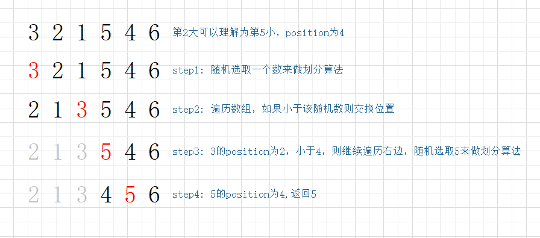
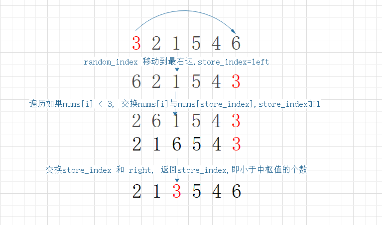

# Top K

# 题目

在未排序的数组中找到第 k 个最大的元素。请注意，你需要找的是数组排序后的第 k 个最大的元素，而不是第 k 个不同的元素。

- 示例1:
  ```
  输入: [3, 2, 1, 5, 6, 4] 和 k = 2
  输出: 5
  ```
- 示例2:
  ```
  输入: [3, 2, 3, 1, 2, 4, 5, 5, 6] 和 k = 4
  输出: 4
  ```

# 解法

- 快速选择




  - 该解法是基于快速选择算法的变种，先随机选择一个中数值
  - 将小于该中数值的往左边移动，将大于该中枢值得往右边移动，最终得到该中枢值得pos
  - 如果 pos = length - k 则终止递归，如果小于，则继续右边重复 前两步，反之左边递归
  ```
  const getTopK = (nums, k) => {
    const swap = (a, b) => {
        let tmp = nums[a]
        nums[a] = nums[b]
        nums[b] = tmp
    }

    const parition = (left, right, random_index) => {
        const random_num = nums[random_index]
        let store_index = left
        swap(random_index, right)
        for(let i = left; i <= right; i++) {
            if (nums[i] < random_num) {
                swap(i, store_index)
                store_index++
            }
        }
        swap(store_index, right)
        return store_index
    }


    const quickSelect = (left, right, k) => {
        if (left == right) return nums[left]
        let random_index = left + Math.floor(Math.random() * (right - left))
        let pos = parition(left, right, random_index)
        if (pos == k) return nums[k]
        else if(pos < k) return quickSelect(pos + 1, right, k)
        return quickSelect(left, pos - 1, k)
    }

    let size = nums.length
    return quickSelect(0, size - 1 , size - k)
  }
  ```
- 小顶堆  
  构建一个长度不大于k的小顶堆  
  ```
  var findKthLargest = function(nums, k) {
    class Heap {
      constructor(data) {
          this.data = [...data]
      }

      _swap(a, b) {
          let tmp = this.data[a]
          this.data[a] = this.data[b]
          this.data[b] = tmp 
      }

      _heapUp(i) {

      }

      _down(index = 0) {
          let len = this.data.length
          let nIndex = index
          let nLeft = (2 * (nIndex + 1)) - 1
          let nRight = (2 * (nIndex + 1)) 
          if (nLeft < len) {
          let target = null
          if (nRight >= len) target = nLeft
          else target = (this.data[nLeft] < this.data[nRight] ? nLeft : nRight)
          if (this.data[nIndex] > this.data[target]) {
              this._swap(nIndex, target)
              this._down(target)
          }
          }
      }

      _insert(value) {
          let nIndex = this.data.length
          this.data.push(value)
          let nFIndex = Math.floor((nIndex - 1) / 2)
          while(nIndex > 0 ){
          if (this.data[nFIndex] > this.data[nIndex]) {
              this._swap(nFIndex, nIndex)
          }
          nIndex = nFIndex
          nFIndex = Math.floor((nIndex - 1) / 2)
          }
      }

      poll() {
          let top_item = this.data[0]
          this.data[0] = this.data.pop()
          this._down(0)
          return top_item
      }

      get size() {
          return this.data.length
      }
    }


    const queue = new Heap([])
    nums.forEach((num, index) => {
        queue._insert(num)
        if (queue.size > k) {
            queue.poll()
        }
    })
    return queue.poll()
  }
  ```