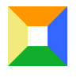

# 纯css画三角形

本文介绍下如何一步步画出三角形，帮助你我更好理解原理。

- 示例1 多彩回字形  


```
.div1 {
  height:20px;
  width:20px;
  border-color:#FF9600 #3366ff #12ad2a #f0eb7a;
  border-style:solid;
  border-width:20px;
}
```
- 示例2 多彩正方形   

```
.div2 {
  height:0;
  width:0;
  border-color:#FF9600 transparent transparent transparent;
  border-style:solid;
  border-width:20px;
}
```
- 示例3  单色三角形  

```
.div3 {
  height:0;
  width:0;
  border-color:#FF9600 #3366ff #12ad2a #f0eb7a;
  border-style:solid;
  border-width:20px;
}
```
- 示例4 单色直角三角形    

```
.div4 {
  height:0;
  width:0;
  border-color:#FF9600 #FF9600 transparent transparent;
  border-style:solid;
  border-width:20px;
}
```
- 示例5 异形三角形    
通过色彩和边框宽度的设置可以实现各种特异形状的三角形  

```
.div5 {
  height:0;
  width:0;
  border-color:#FF9600 #3366ff #12ad2a #f0eb7a;
  border-style:solid;
  border-width:20px 30px 40px 50px;
}
```