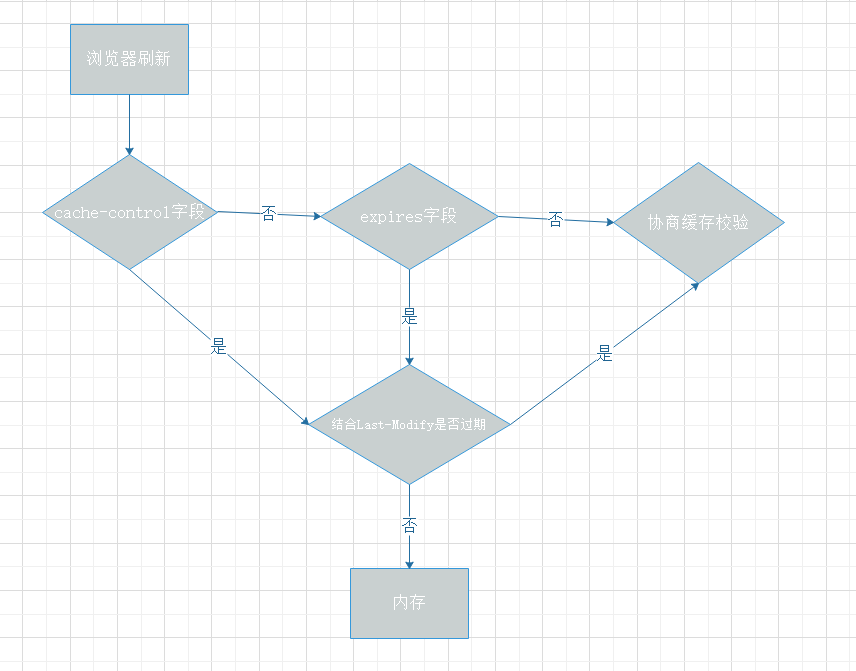
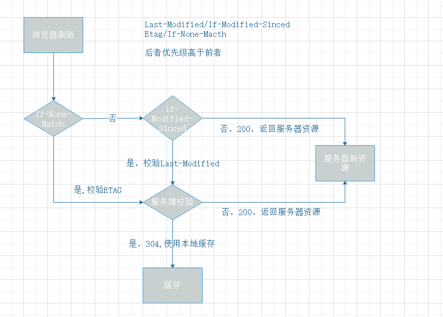

# 浏览器缓存机制

优秀的缓存策略可以减少资源的重复加载从而提升web性能、体验，缓存一般分类强制缓存和协商缓存

## 强制缓存

- Cache-Control 来自HTTP1.1规范,Expires 来自HTTP1.0规范，前者优先级高于后者，二者都需要结合Last-Modify来校验

### Cache-Control值说明

- Public  
  表明响应可以被任意对象缓存(发送请求的客户端、代理服务器等等)
- Private  
  表明响应只能被单个用户缓存(即代理服务器无法缓存)
- no-cache  
  强制要求浏览器将缓存提交给服务器验证
- no-store  
  不缓存
- max-age=< seconds >  
  设置缓存的最大周期
- s-maxage=< seconds >  
  仅适用于共享内存(public各个代理服务器),Private会忽略这个属性
- max-stale[=< seconds >]  
  表明客户端可接受一个过期文件，在过期时间上加上设置的值
- min-fresh=< seconds >  
  设置缓存在多长周期内都是以服务器资源为最新
- must-revalidate  
  必须重新验证，在验证之前不可使用缓存来响应

### Expires 值说明

- <http-date>  
  表示资源在该日期内未过期，当Cahce-control设置max-age或s-max-age时该设置失效

## 协商缓存

- Last-Modified/If-Modified—Since
  Last-Modified为response header，验证时会设置If-Modified-Since的值为Last-Modified的值进行校验。  
  ***缺陷  1)因为时间以秒为单位，所以精度不够 2)如果打开了本地缓存文件，则last-modified时间会被更改***

- ETag/If-None-Match(HTTP1.1)  
  ETag为该资源的唯一hash标识，验证时会设置If-None-Match的值为ETag进行校验，优先级高于Last-Modified。   
  ***缺陷 1)因为要计算文件hash值，性能不高***

## 实际使用中的建议

- 经常变动的文件  
  设置Cache-Control: no-cache，强制要求资源每次去服务器校验

- 不经常变动的文件
  设置Cache-Control: max-age=31536000, 缓存个一年