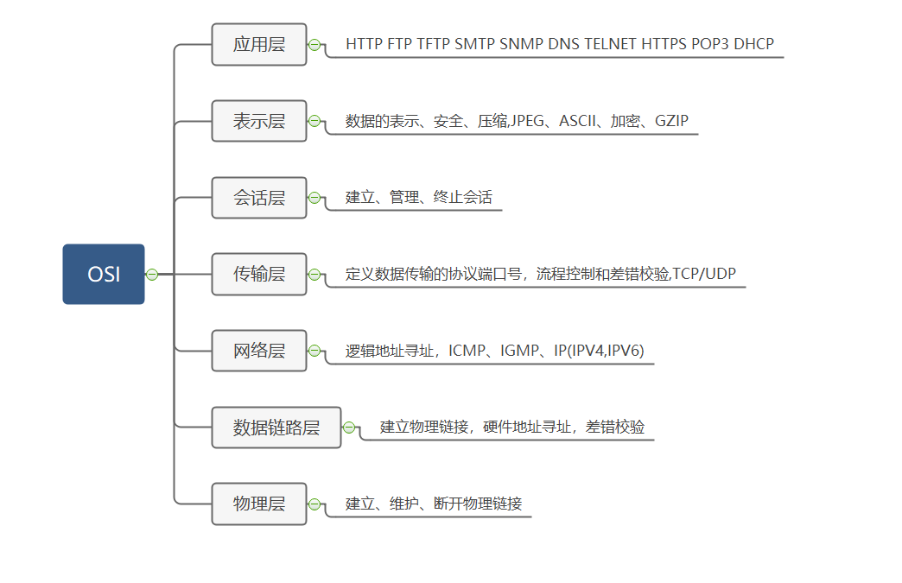
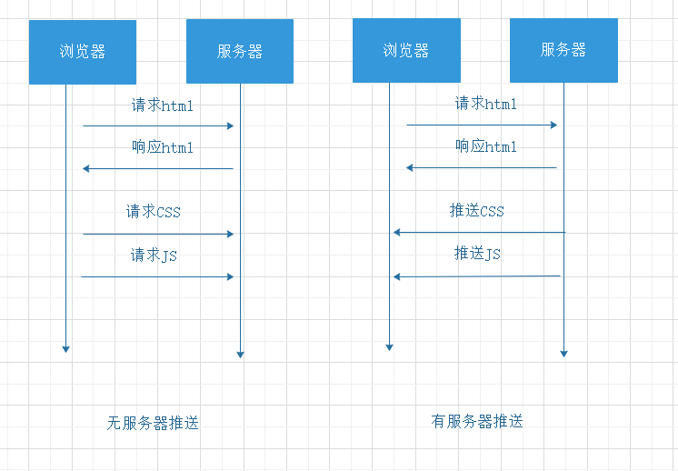

# HTTP2.0的四大特性

## 七层模型

在聊HTTP2.0之前先来聊一下OSI协议,即OPEN SYSTEM INTERCONNECTION,是一个抽象表示通信系统间互联的标准体系模型。

> 在五层模型中会将应用层、表示层、会话层合称为应用层。

## HTTP1.0,HTTP1.1

再说2.0之前以"浏览器先后发送A，B两个请求"为例来说一下1.0,1.1的弊端。
- 1.0
  - 建立TCP链接后，先发送A请求，等待A请求响应完成后发送B请求。
- 1.1
  - 引入了管道机制，先后发送A，B请求，同时会先响应A，再响应B，这就是著名的"队头阻塞"问题。
- 1.0,1.1
  - 报文为文本格式，解析慢

## 四大特性

### 二进制传输

2.0高效最大的一个原因实在应用层和传输层之间新增了一个"二进制分帧层"，在此基础上，所有流入流出的数据都会分割为更小的消息和块，并通过streamID来关联。

### 多路复用

- 可以并行交错的发送多个请求，且互相不影响。
- 可以并行交错的接受响应，响应之间互不干扰，解决了HTTP1.1的对头阻塞问题。
- 只使用一个TCP链接，即可发送接受多个请求响应，消除不必要的链接延迟。

### 首部压缩

- 客户端、服务器会各自维护一套header缓存表，避免不必要的header发送减少字节数据开销。
- header信息通过GZIP、COMPRESS压缩后再进行传输。

### 服务推送

#### 特性
以一个web页面加载为例

- 无服务推送
  - 请求html
  - 返回、解析html
  - 解析到html中的css,js文件
  - 请求css，js文件
- 有服务器推送
  - 请求html
  - 返回html
  - 返回css文件
  - 返回js文件

#### 如何配置?

- nginx配置
- app server配置

> 如何避免重复推送呢?可以通过设置cookie的方式实现
