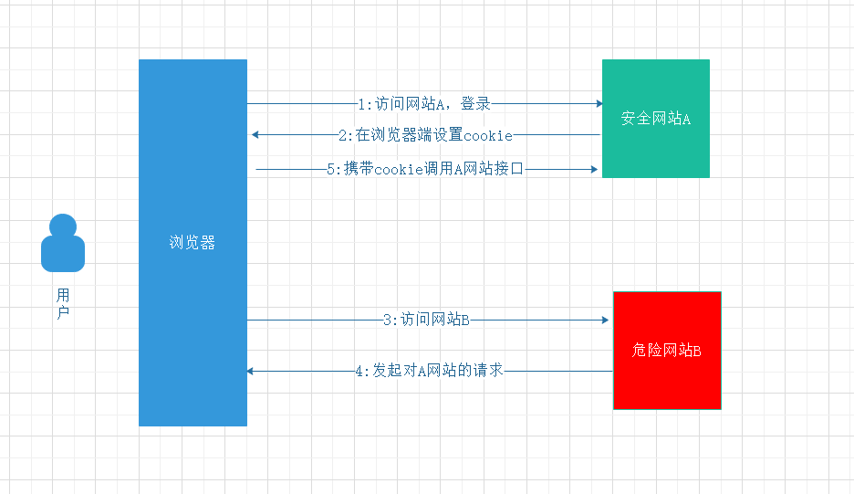

# 预防CSRF跨站请求伪造

## 什么是CSRF跨站请求伪造？

CSRF(cross-site request forgery),即攻击者可以盗用你的身份发邮件，甚至盗用你的帐号去支付。

## CSRF原理

## 如何预防呢?

- Refer校验

  服务端对请求refer进行校验

  **优点**
  - 配置简单，对业务侵入性小

  **缺点**
  - 如果浏览器存在漏洞，refer会被伪造

- 参数添加Token校验

  服务端生成一个随机性token返还给浏览器，浏览器再下次请求时将token带上校验。

  **缺点**
  - 代码侵入性大
  - 难以保障token的安全

- HTTP头添加token

  **缺点**
  - 只能实现ajax请求的防御，局限性大

***总的来说，这几种方案都不完美，期待未来有更好的方案去解决这个问题，另外服务端在写重要接口时，一定要用POST!!!***