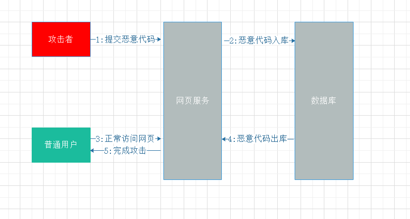
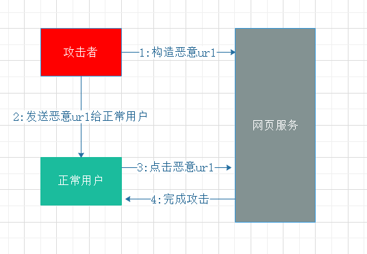
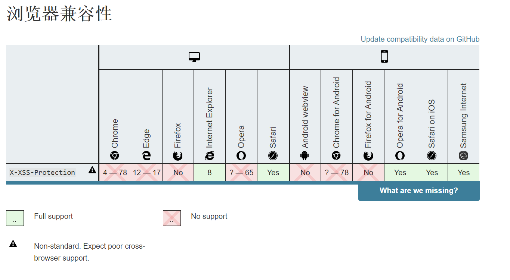

# 预防XSS跨站脚本攻击

## 什么是XSS跨站脚本攻击

XSS(Cross-site script), 因与css重名，故而被命名为XSS。

## XSS攻击原理

html在解析过程中会根据特定字符来区分html标签和文本,当html中插入的内容中有类似<的标签时，浏览器会认为插入了一段html执行脚本，所以当程序并没有对插入内容进行过滤时，就会产生xss漏洞。

## XSS分类

- 存储型  
  存储型即恶意代码被存入数据库，当用户打开目标网站，服务器从数据库读取恶意代码，拼接在html中返给浏览器执行。
  
- 反射型  
  攻击者构造出带有恶意代码的url链接引导用户点击，当用户打开时恶意代码被拼接在html中并返给浏览器执行
  

## 如何预防

- cookie设置httpOnly  
  xss漏洞一般会利用javascript去读取你的cookie发送到攻击者服务器，设置之后js将无法读取cookie。
  > 伤敌一千,自损八百
- 设置X-XSS-Protection  
  设置Response header 中的X-XSS-Protection属性为1;mode=block;当浏览器检测到XSS攻击时，会自动停止渲染页面。
  > 不处于任何草案，兼容性一般
  
- HTML转义
  无论你的页面是由服务端渲染还是客户端渲染，都可以采用一些完善的转义库去有效的避免XSS漏洞，另外还可以采用一些自动转义的模板引擎/框架。

## 总结

  技术发展并不是一成不变的，道高一尺魔高一丈，技术很难去完全避免漏洞，所以一个好的开发习惯很重要。