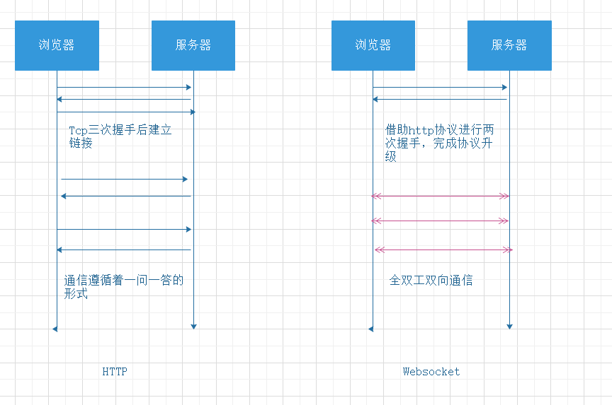

# Websocket 实现原理

websocket是html5规范下在单个tcp链接上实现全双工通讯的新协议

## HTTP 和 Websocket



## Websocket的特点

- 建立在传输层TCP协议之上
- 握手阶段基于HTTP协议，所以会和HTTP公用80/443端口,可代理
- 没有同源限制
- 协议标识是ws，加密协议标识为wss，url为 ***ws://a.com/somepath***
- 可以发送文本，也可以发送二进制数据(HTTP2.0以下都只能发送文本)
- 发送数据比较轻量(没有HTTP繁琐的header)

## http如何升级为websocket

- Request  

```
Upgrade: websocket
Connection: Upgrade // 以上两个字段表示浏览器请求将http协议升级为websocket协议
Sec-WebSocket-Key: x3JJHMbDL1EzLkh9GBhXDw== // 浏览器随机生成的base64
Sec-WebSocket-Protocol: chat, superchat // 子协议
Sec-WebSocket-Version: 13 // websocket协议版本
```
- Response  
```
HTTP/1.1 101 Switching Protocols // 允许升级协议
Upgrade: websocket
Connection: Upgrade
Sec-WebSocket-Accept: HSmrc0sMlYUkAGmm5OPpG2HaGWk= // 将Sec-WebSocket-Key与258EAFA5-E914-47DA-95CA-C5AB0DC85B11拼接后经过sha1安全散列算法计算后再base64编码
Sec-WebSocket-Protocol: chat
```
- Sec-webSocket-Accept 计算
```
server = http.createServer().listen(3000)
server.on('upgrade', function(req, socket) {
  let key = req.headers['sec-websocket-key]
  const repKey = crypto.createHash('sha1').update(key + '258EAFA5-E914-47DA-95CA-C5AB0DC85B11').digest('base64')
})
```