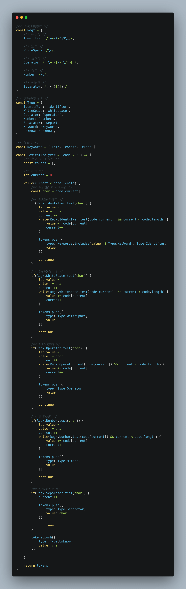
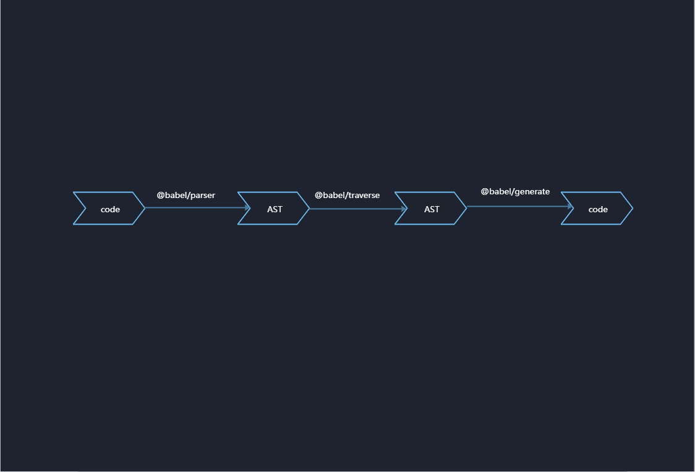
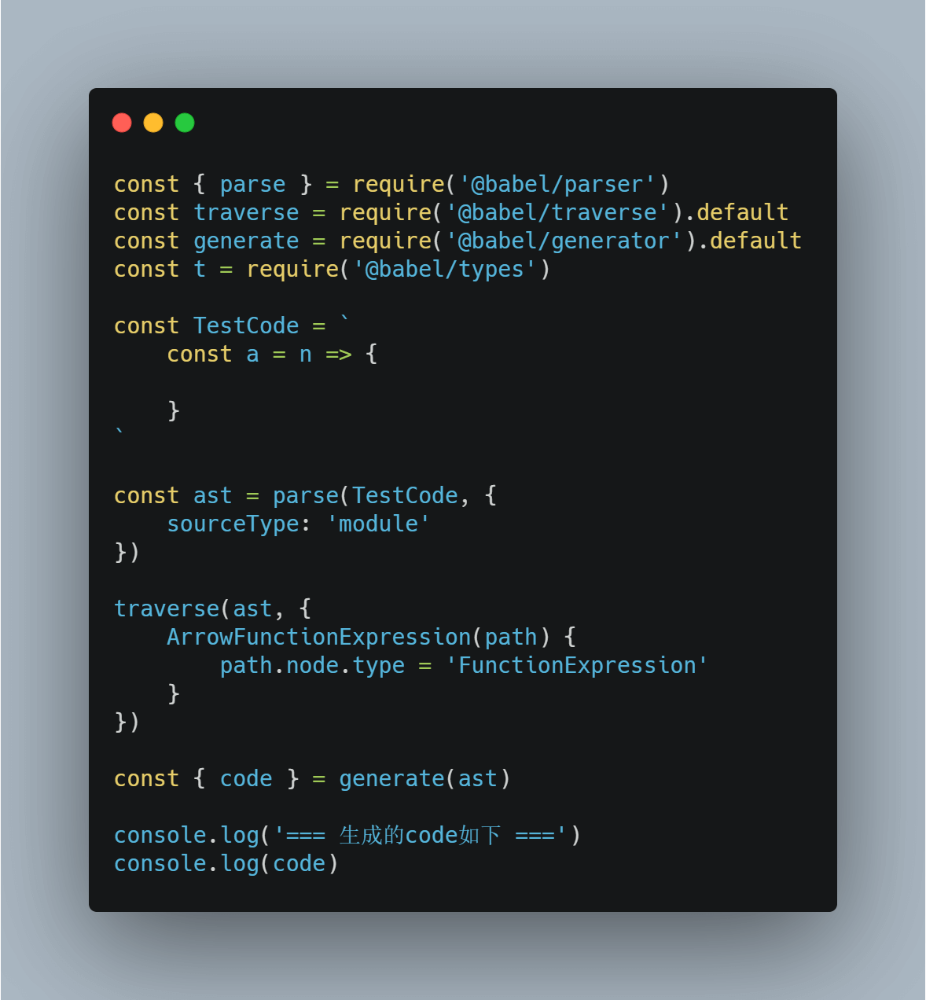

# JS中AST的使用

## AST是什么

> 在计算机科学中，抽象语法树（Abstract Syntax Tree，AST），或简称语法树（Syntax tree），是源代码语法结构的一种抽象表示。它以树状的形式表现编程语言的语法结构，树上的每个节点都表示源代码中的一种结构。之所以说语法是“抽象”的，是因为这里的语法并不会表示出真实语法中出现的每个细节。比如，嵌套括号被隐含在树的结构中，并没有以节点的形式呈现；而类似于 if-condition-then 这样的条件跳转语句，可以使用带有三个分支的节点来表示。

## AST怎么产生的

### AST生成过程

#### 词法分析

> 词法分析是计算机科学中将字符序列转换为标记（token）序列的过程

常见词法单元如下:

| 词法单元 | 含义 | 模式 | 举例 |
|  ----  | ---- | ----  | ---- |
| keyword | 保留字 | | let、const、class等 |
| idenitifier | 标识符 | 以字母、_、$开头的连续字符 | const、let、a |
| operator | 操作符 | | *、/、+、- |
| whitespace | 空白符 | | |
| number | 数字 | | |
| separator | 分隔符 | | {、}、(、)|
| ... | | |

示例词法解析程序:

示例词法解析结果如下:

#### 语法分析

> 语法分析是根据某种给定的形式文法对由单词序列（如英语单词序列）构成的输入文本进行分析并确定其语法结构的一种过程

常见语法单元如下:

| 语法单元 | 含义 | 举例 |
|  ----  | ---- | ---- |
| VariableDeclaration | 变量声明 | const a = 1, b = 2 |
| ImportDeclaration | 导入申明 | import antd from 'antd' |
| FunctionExpression | 函数表达式 | function() { } |
| ... | | | 

[参考babel](https://github.com/babel/babel/blob/master/packages/babel-parser/ast/spec.md)

示例语法解析程序:

### 市面上的解析器

- [online astwxplorer.net](https://astexplorer.net/)
- [acorn](https://github.com/acornjs/acorn/tree/master/acorn)
- [esprima](https://github.com/jquery/esprima)
- [babel](https://github.com/babel/babel/tree/master/packages/babel-parser)
- Typescript
- eslint 

## AST的使用场景

- 代码格式化、代码高亮、代码自动补全
- elsint、jslint等代码检查
- webpack、rollup代码打包
- typescript、jsx等转化为原生代码
- 代码重复率检测

## AST实战使用

### [1] 编写一个babel插件(es6箭头函数转es5)

#### babel 编译的过程

#### 如何编写babel插件

- 比较ast的差异

- 修改ast

### [2] wepy转vue

#### 示例源码

#### 转换思路

- 去除wepy导入
- class转化为object
- 生命周期转化

#### 代码实践

[wepy转vue](https://github.com/TNT-Likely/AST_DEMO/blob/master/04-WepyToVue/lib/index.js)
