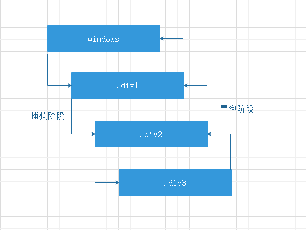

# JS事件模型

js事件模型分为事件捕获和事件冒泡

## 事件捕获和事件冒泡

- 事件捕获即触发事件时，事件会从根元素(window)一直传递到目标元素
- 与事件捕获相反，当触发事件冒泡时，事件会从目标元素一直传递至根元素(window)

```html
<html>
<head></head>
<body>
  <div class="div1">
    <div class="div2">
      <div class="div3"></div>
    </div>
  </div>
  <script src="index.js"></script>
</body>
</html>
```

```
window.addEventListener('click', function(e) {
  console.log('window => ', e)
}, false)

document.querySelector('.div1').addEventListener('click', function(e) {
  console.log('div1 => ', e)
}, false)

document.querySelector('.div2').addEventListener('click', function(e) {
  console.log('div2 => ', e)
}, false)

document.querySelector('.div3').addEventListener('click', function(e) {
  console.log('div3 => ', e)
}, false)
```



### e 的主要属性与方法

- .bubbles [只读] 表示该事件是否在dom中冒泡
- .cancelBubble [布尔值] 为true时停止冒泡
- .cancelable [只读] 表示该事件是否可以被取消
- .currentTarget [只读] 表示注册事件dom的引用
- .target [只读] 表示触发事件dom的引用
- .type [只读] 表示事件的类型
- .preventDefault() 阻止默认事件
- .stopPropagation() 阻止事件冒泡

## 如何切换事件处理模型

```
target.addEventListener(type, listener, useCapture);
```
- type 事件类型
- listener 事件监听函数
- useCapture [布尔值] 默认为fasle即按照冒泡来触发，为true则为捕获

## 捕获和冒泡适用场景

- 捕获 全局监听、事件拦截、键盘监听
- 冒泡 事件代理

## 注意事项

- 事件冒泡可停止冒泡(.stopPropagation()), 事件捕获不可停止
- 并非所有事件都支持冒泡，[具体可查询](w3.org/TR/DOM-Level-3-Events/#event-type-load), bubbles属性为no的不支持冒泡
  - load
  - unload
  - scroll
  - resize
  - blur
  - focus
  - mouseleave
  - mouseenter
- 冒泡仅在同类型事件中冒泡