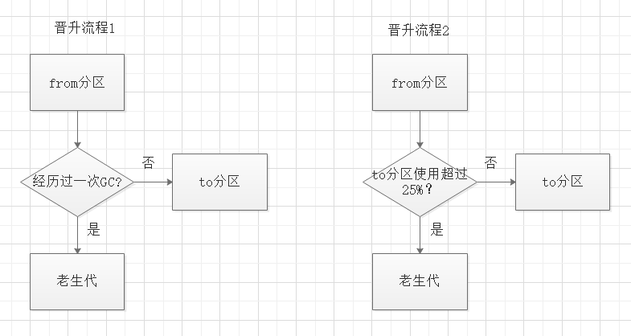

# v8引擎的垃圾回收机制

## 如何查看node内存使用情况?

```
> process.memoryUsage()
{
  rss: 19189760, // 进程驻留内存(堆/栈/代码段)
  heapTotal: 4608000, // v8总内存
  heapUsed: 2342320, // v8已使用内存
  external: 1387045 // v8内置的c++对象占用内存
}
```

## v8的内存分类

- 堆内存 // 对象、字符串、闭包
  - 新生代内存
  - 老生代内存
- 栈内存 // 变量
- 堆外内存 // Buffer

## 新生代内存清理算法(Scavenge清道夫?)

### 特性

- 内存空间平分为两个区域from、to(闲置)
- 每次GC将存活的对象从from区域复制到to区域

### 缺点
  - 浪费一半的内存空间

### 晋升流程



## 老生代内存清理算法(mark-sweep,mark-compact)

### mark-sweep 标记清除(v8主要使用)

#### 特性

- 标记阶段，只标记或者的对象
- 清理阶段，删除没有被标记的对象

#### 缺点

- 内存不连续，存在碎片


### mark-compact 标记整理(内存不足/对象晋升时使用)

#### 特性

- 标记阶段，只标记或者的对象
- 清理阶段，删除没有被标记的对象,并将活着的对象向一端移动

### 缺点

- 慢

## 内存泄漏排查

### node-heapdump

