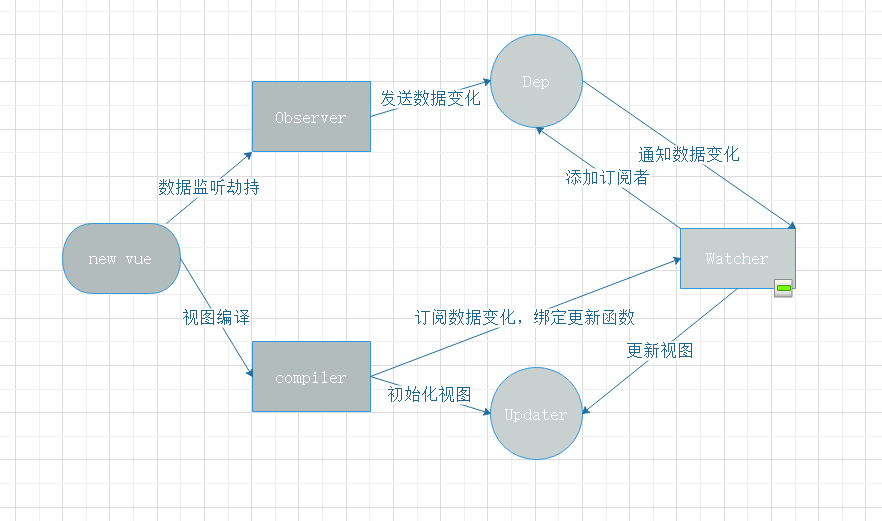

# 响应式设计原理

## 设计原理

- Observer  
  主要负责数据的劫持监听,vue初始化时会遍历枚举data的属性，利用Object.defineProperty一一进行,由于Object.defineProperty在2011年发布的ES5.1才被确认，所以vue2.0不支持IE9、safari5.1等以下的浏览器，具体可查阅MDN。
- Dep  
  主要负责依赖收集: 1)接受来着Watcher模块的订阅(addSub)。 2)通知Watcher模块数据的变化(notify)。
- Watcher  
  主要负责订阅依赖收集(Dep.addSub)，通知Updater完成视图更新
- Compiler  
  主要负责: 1)通过Updater初始化视图。 2)通过Wacther订阅数据变化，绑定Updater函数
- Updater  
  主要负责视图的初始化、更新

## Observer的缺陷

你一定用过vm.$set这个api吧...  
当监听的是一个Object、Array时，Observer则监听不到，针对[数组方法](https://cn.vuejs.org/v2/guide/list.html#%E5%8F%98%E5%BC%82%E6%96%B9%E6%B3%95-mutation-method)vue做了一些hack,但是这远远不够。 

### 怎么解决这个问题
Vue3.0采用[proxy](https://es6.ruanyifeng.com/#docs/proxy)来代替Object.defineProperty